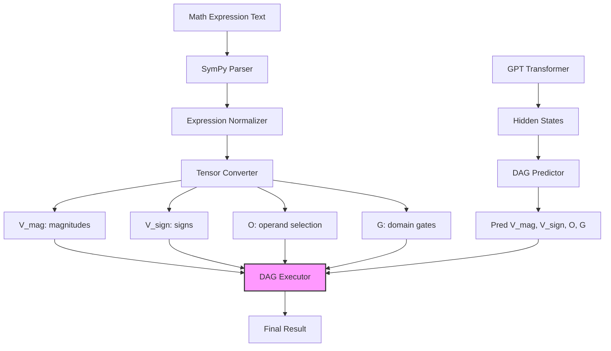

# nanoGPT-DAG

Lightweight numeric-reasoning on top of [nanoGPT](https://github.com/karpathy/nanoGPT).
A differentiable directed-acyclic-graph (DAG) module lets GPTs learn to execute
mathematical expressions by predicting tensor representations of computation graphs
and executing them differentiably – all in a single forward/backward pass.

## Quick Start

```bash
# 1. Install minimal deps (CPU-only)
pip install -r requirements-dev.txt

# 2. Train DAG predictor model
python train_predictor.py config/train_predictor_config.py

# 3. Run tests
pytest -q 
```

## Project Overview

This project implements a novel tensor-based DAG execution system for mathematical reasoning:

**Core Innovation**: Mathematical expressions are converted into fixed-size tensor representations 
that can be executed differentiably by a neural DAG executor. The model learns to predict 
these tensor representations from text, enabling precise mathematical computation within 
transformer architectures.

**Key Components**:
- **Expression Normalization**: SymPy expressions are normalized using custom operations (`Div`, `Sub`, `Neg`)
- **Tensor Conversion**: Expressions become fixed-size tensors (`V_mag`, `V_sign`, `O`, `G`)
- **DAG Execution**: A differentiable executor processes tensors to compute results
- **End-to-End Training**: Prediction and execution losses train the full pipeline

**Example Flow**:
1. Input: `"2.5 * 3.0 + 1.0"`
2. SymPy parsing & normalization 
3. Tensor representation: magnitude/sign vectors + operation matrices
4. DAG execution: differentiable arithmetic computation
5. Output: `8.5` (with gradients for training)

## Architecture

### DAG Tensor Representation

The system uses a **50/50 node architecture** with `dag_depth * 2` total nodes:
- **Initial nodes** (50%): Store input values from the expression
- **Intermediate nodes** (50%): Store results of arithmetic operations

**Tensor Components**:
- `V_mag`: Value magnitudes for all nodes
- `V_sign`: Value signs (+1/-1) for all nodes  
- `O`: Operand selection matrix (which nodes to use in operations)
- `G`: Domain selector (0=log domain for ×÷, 1=linear domain for ±)



## Key Features

- **Tensor-Based DAG Execution**
  - Fixed-size tensor representation for any mathematical expression
  - 50/50 node architecture: initial values + intermediate computations
  - Differentiable execution with precise gradient flow
  - Mixed-domain computation (linear for +/-, log for ×/÷)

- **Expression Processing**
  - Custom SymPy operations (`Div`, `Sub`, `Neg`) for clean normalization
  - Handles multi-argument operations and complex nested expressions
  - Robust error handling and validation
  - Causal execution ensuring no future information leakage

- **Training & Loss Functions**
  - Multi-component loss: magnitude, sign, operation selection, domain gates
  - Execution loss comparing predicted vs actual results
  - Robust loss functions handling wide value ranges
  - Comprehensive masking for variable-length sequences

- **Performance & Reliability**
  - High-precision computation (float64) for numerical stability
  - Efficient tensor operations with GPU optimization
  - Streaming dataset with on-the-fly example generation
  - Comprehensive test suite with accuracy validation

## Project Structure

```
.
├─ train_predictor.py              – DAG predictor training
├─ train.py                        – Full model training (future)
├─ models/
│  ├─ dag_model.py                 – DAGExecutor + GPT with DAG capability
│  ├─ predictor_only_model.py      – Predictor-only model for pretraining
│  └─ base_model.py                – Shared transformer backbone
├─ data/dagset/
│  ├─ streaming.py                 – Expression-to-tensor conversion + data loading
│  └─ generate_expression.py       – SymPy expression generation
├─ predictor_utils.py              – Loss functions and training utilities
├─ evaluate.py                     – Model evaluation and metrics
├─ config/                         – Training configurations
├─ tests/                          – Comprehensive test suite
└─ README.md
```

## Technical Details

### DAG Tensor Format

Each mathematical expression is converted to fixed-size tensors:

- **`V_mag`** `(B, T, dag_depth*2)`: Magnitude values for all nodes
- **`V_sign`** `(B, T, dag_depth*2)`: Sign values (+1/-1) for all nodes
- **`O`** `(B, T, dag_depth, dag_depth*2)`: Operand selection (which nodes participate in each operation)
- **`G`** `(B, T, dag_depth)`: Domain selector (0=log for ×÷, 1=linear for ±)

### Expression Normalization

Before tensor conversion, SymPy expressions are normalized:
```python
# Before: Mul(-1, x) → After: Neg(x)
# Before: 1/x → After: Div(1, x)  
# Before: a - b → After: Sub(a, b)
```

Custom SymPy operations ensure clean, consistent tensor representations.

### Execution Flow

1. **Initial Phase**: First `dag_depth` nodes store input values
2. **Operation Phase**: Next `dag_depth` nodes store operation results
3. **Causal Masking**: Operations only see previous nodes (no future leakage)
4. **Mixed Domains**: Addition/subtraction in linear space, multiplication/division in log space
5. **Final Result**: Last intermediate node contains the expression result

## Checkpointing

Supported initialization modes:
- `init_from="scratch"` - Fresh initialization
- `init_from="resume"` or `"latest"` - Load latest checkpoint
- `init_from="gpt2"`, `"gpt2-medium"`, etc. - Load pretrained GPT-2
- `init_from="path/to/checkpoint.pt"` - Load specific checkpoint

## License

MIT (same as nanoGPT)