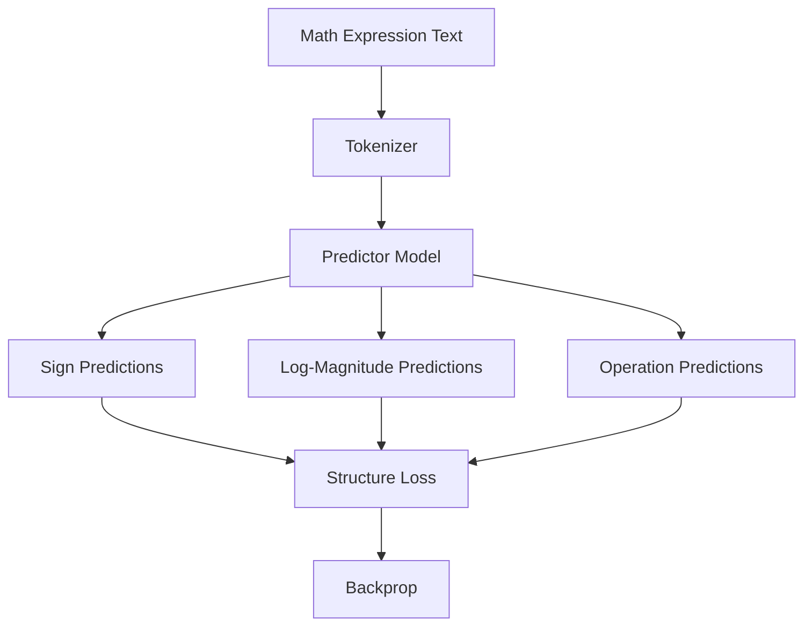
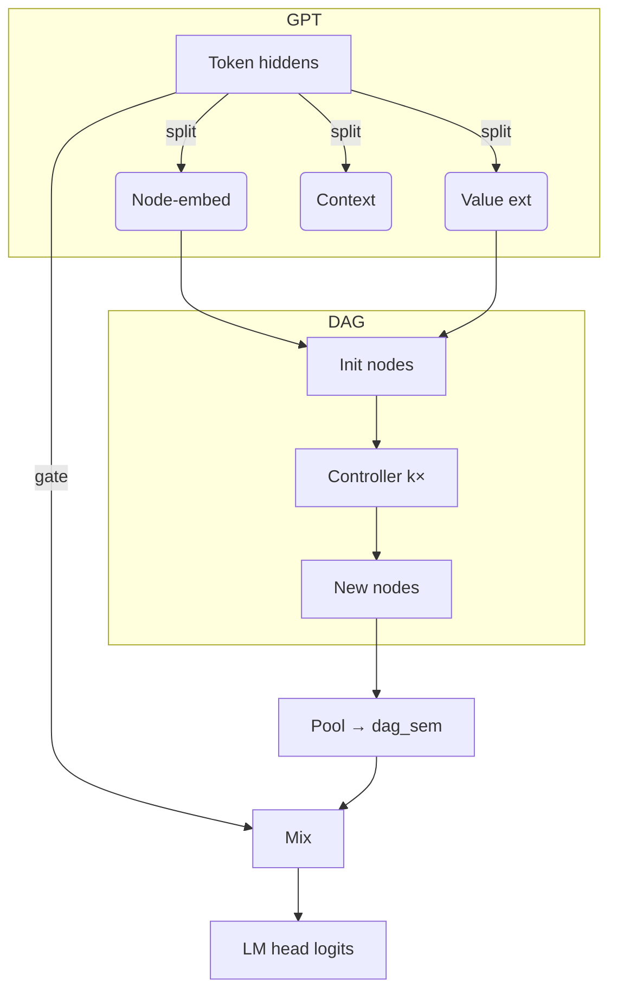

# nanoGPT-DAG

Lightweight numeric-reasoning on top of [nanoGPT](https://github.com/karpathy/nanoGPT).
A differentiable directed-acyclic-graph (DAG) module lets even tiny GPTs
extract numbers ✦ perform a few arithmetic steps ✦ fold the result back into the
LM stream – all in a single forward / backward pass.

---

## Current Status: DAG Predictor Pretraining

This project uses a **two-phase training approach**:

1. **Phase 1: DAG Predictor Pretraining** (Current Focus)
   - Train specialized predictor components on DAG structure prediction
   - Learn to predict signs, log-magnitudes, and operations from text
   - Optimized for cloud training on RunPod with maximum GPU utilization

2. **Phase 2: Full Model Training** (Future)
   - Integrate pretrained predictors with full GPT+DAG architecture
   - End-to-end training on language modeling + numeric reasoning

---

## Quick start

```bash
# 1. install minimal deps (CPU-only)
pip install -r requirements-dev.txt

# 2. run DAG predictor pretraining (current focus)
python train_predictor.py config/train_predictor_config.py

# 3. run full model training (future)
python train.py config/train_default.py --dag_depth=2 --max_iters=100

# 4. run tests
pytest -q        # ~70 tests, <5 s on laptop
```

---

## DAG Predictor Pretraining

The current training phase focuses on teaching the model to predict DAG structures from mathematical expressions:

**Input**: Text like `"five point two two minus three point two one three divided by two point three two"`

**Output**: Structured predictions for:
- **Signs**: Whether each node value is positive/negative
- **Log-magnitudes**: Logarithmic scale of absolute values  
- **Operations**: Which arithmetic operations to perform

**Key optimizations**:
- **GPU utilization**: 97% (up from 8%)
- **Large batch training**: 1024 × 16 = 16,384 effective batch size
- **Learning rate scaling**: Adjusted for large batch stability
- **Cloud-optimized**: Configured for RunPod training infrastructure

---

## What's inside  
• **DAG module** – value extractor, controller, operations (+ × − ÷ …)  
• **PredictorOnlyModel** – specialized architecture for structure prediction pretraining
• **Gate mixer** – fuses DAG result with last token hidden state  
• **`DAGLogger`** – one-stop gradient/metric collector, wandb-ready  
• **Streaming dataset** – on-the-fly DAG example generation with English conversion
• **Slim test-suite** – 69 functional + 1 integration test

---

## Architecture Overview

### Phase 1: Predictor Pretraining (Current)


### Phase 2: Full Model (Future)


---

## Training Configurations

### Predictor Pretraining
- **Model**: PredictorOnlyModel (1.6M parameters)
- **Batch size**: 1024 × 16 gradient accumulation = 16,384 effective
- **GPU utilization**: 97% (highly optimized)
- **Learning rate**: 1e-3 (scaled for large batches)
- **Dataset**: Streaming DAG generation with English conversion

### Full Model Training
- **Model**: GPT + DAG (configurable size)
- **Standard nanoGPT training** with DAG extensions
- **Future work** after predictor pretraining

---

## Logging & monitoring

`DAGLogger` captures:
* gate stats, hidden norms
* per-op gradients (add, sub, mul, id)
* gradients of `final_hidden` & `final_values`
* node value timelines
* GPU utilization and memory usage

`wandb.log(dag_logger.get_wandb_logging_dict(model))` – done.

---

## Directory layout

```
.
├─ train_predictor.py  – DAG predictor pretraining script
├─ train.py            – full model trainer
├─ models/
│  ├─ dag_model.py     – GPT + DAG architecture
│  └─ predictor_only_model.py – standalone predictor model
├─ data/dagset/        – streaming DAG dataset generation
├─ config/
│  ├─ train_predictor_config.py – predictor pretraining config
│  └─ train_*.py       – various training configurations
├─ dag_logger.py       – logging / wandb bridge
├─ tests/              – 70 nosy tests  (≈4 s)
└─ README.md           – this file
```

---

## Cloud Training (RunPod)

Optimized for cloud GPU training with:
- **High GPU utilization**: 97% compute, 44% memory
- **Large batch processing**: 16,384 effective batch size
- **Efficient data generation**: 8,000 examples per batch
- **Checkpoint management**: Automatic cleanup for storage efficiency
- **wandb integration**: Real-time monitoring and logging

---

## License
MIT (same as nanoGPT)

## Differentiable DAG (per-token version)

Each token now owns an **independent, append-only scratch list** of scalar nodes.  Let `D = dag_depth`.

1.  Slot 0 is the value extracted from the token's transformer embedding.
2.  For each step `s ∈ [0, D-1]` the planner predicts:
    * `operand1`, `operand2`  – categorical over current `s+1` slots.
    * `op` – categorical over primitive operations {add, identity, multiply, subtract}.
3.  The executor reads the chosen operands, applies the selected op, and **appends** the result to slot `s+1` (no overwrites).
4.  After `D` steps the final slot (index `D`) is projected back to embedding space and mixed with the original transformer hidden state as:
   ```python
   dag_hidden_norm = LayerNorm(H) (dag_hidden) * dag_scale
   mixed_hidden    = orig_hidden + dag_hidden_norm
   ```

Tensor shapes (B=batch, T=sequence, S=D+1, n_ops=4):

| tensor                      | shape             |
|-----------------------------|-------------------|
| `operand*_probs`            | (B, T, D, S)      |
| `operation_probs`           | (B, T, D, n_ops)  |
| scratch values during exec  | (B, T, ≤S)        |
| final hidden                | (B, T, H)         |

The design guarantees causality:
* Tokens never access other tokens' scratch lists.
* At step `s`, masks ensure only slots `0..s` are visible.

See `dag_model.DAGPlanPredictor` and `dag_model.DifferentiableDAG` for implementation details.
