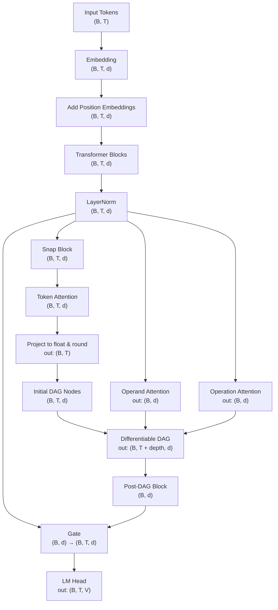

# nanoGPT DAG Experiment

This repository adds a differentiable DAG layer to [nanoGPT](https://github.com/karpathy/nanoGPT)
for lightweight numeric reasoning. The DAG controller attends over earlier nodes
and selects simple arithmetic operations (see `dag_model.py`). `DAGGPT` keeps a
copy of the input embeddings for the DAG stream and mixes the resulting value
back with the transformer state before decoding the final token.
The module implements basic ops (`add`, `multiply`, `subtract`, `divide`, `identity`,
`power`, `log`, `max`, `min`) and learns to compose them via attention.
The experiment evaluates whether this reasoning layer improves performance on small arithmetic problems.

## Architecture

The figure below illustrates how the differentiable DAG layer plugs into the regular GPT pipeline. After the final layer
normalization, the model splits into three branches. One path "snaps" each token to a numeric value used to seed a
differentiable DAG. Two additional attention blocks derive operand and operation context vectors from the same hidden
states. The DAG uses these contexts to choose its inputs and operations. Its final node is passed through a small
transformer block to return to the semantic space before a gating layer mixes this result with the transformer state prior
to decoding the final token.



## Installation

```bash
pip install -r requirements-dev.txt
```

## Training

Run a toy training job on CPU using the default configuration:

```bash
python train.py config/train_default.py --dag_depth=4
```

Any option in `TrainConfig` can be overridden on the command line, e.g.
`--max_iters=100` or `--batch_size=4`.

## Testing

```bash
pytest
```

The tests cover the DAG logic and the training script.

## Benchmark

```bash
python bench.py
```

This benchmarks a minimal model forward and backward pass.

## Lambda Cloud

Set up a virtual environment and install the dependencies:

```bash
python3 -m venv env
source env/bin/activate
pip install requests
```

Launch training in the cloud using your API and SSH key:

```bash
export LAMBDA_API_KEY=YOUR_KEY
export LAMBDA_SSH_KEY=YOUR_SSH_KEY_NAME
python lambda_service.py train config/train_default.py --instance gpu_1x_a10 --region us-east-1
```

To enable Weights & Biases logging, provide your ``WANDB_API_KEY``:

```bash
export LAMBDA_API_KEY=YOUR_KEY
export LAMBDA_SSH_KEY=YOUR_SSH_KEY_NAME
export WANDB_API_KEY=YOUR_WANDB_KEY
python lambda_service.py train config/train_daggpt_lambda.py
```

### Troubleshooting tips

* **Authentication errors** – confirm the ``LAMBDA_API_KEY`` is valid.
* **Storage full** – check disk usage with ``df -h`` and remove large files.
* **Leaked API keys** – revoke the compromised key from the console.
