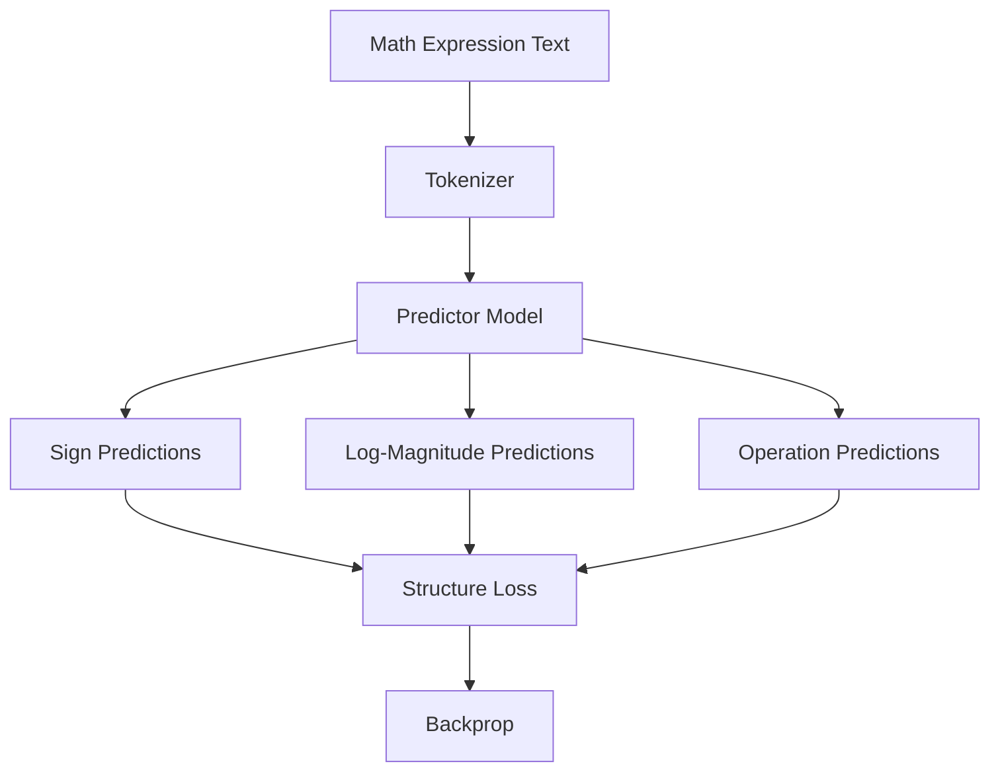
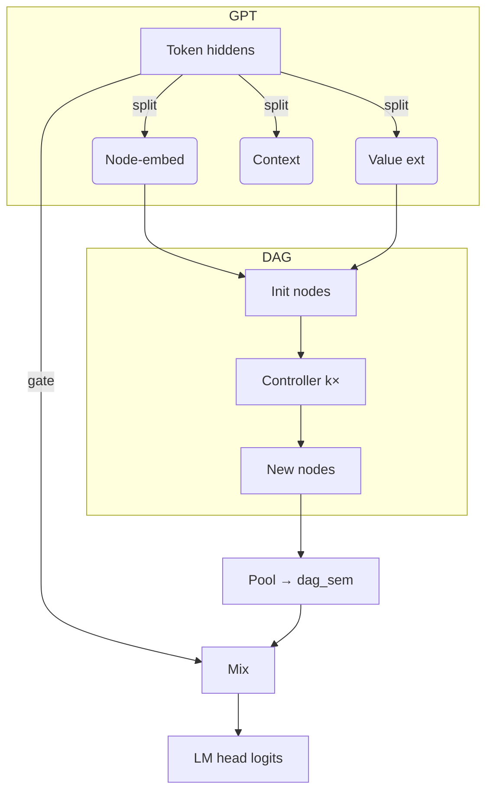

# nanoGPT-DAG

Lightweight numeric-reasoning on top of [nanoGPT](https://github.com/karpathy/nanoGPT).
A differentiable directed-acyclic-graph (DAG) module lets even tiny GPTs
extract numbers ✦ perform arithmetic steps ✦ fold the result back into the
LM stream – all in a single forward/backward pass.

## Quick Start

```bash
# 1. Install minimal deps (CPU-only)
pip install -r requirements-dev.txt

# 2. Run DAG predictor pretraining (current focus)
python train_predictor.py config/train_predictor_config.py

# 3. Run tests
pytest -q 
```

## Project Overview

This project uses a two-phase training approach:

1. **DAG Predictor Pretraining** (Current Focus)
   - Train specialized predictor components on DAG structure prediction
   - Learn to predict signs, log-magnitudes, and operations from text
   - Example input: `"five point two two minus three point two one three divided by two point three two"`
   - Outputs: Signs (±), log-magnitudes, and arithmetic operations

2. **Full Model Training** (Future)
   - Integrate pretrained predictors with full GPT+DAG architecture
   - End-to-end training on language modeling + numeric reasoning

## Architecture

### Current: Predictor Pretraining


### Future: Full Model


## Key Features

- **High Performance**
  - 97% GPU utilization
  - 16,384 effective batch size (1024 × 16 gradient accumulation)
  - Optimized for cloud training on RunPod

- **Components**
  - DAG module with value extractor, controller, operations (+ × − ÷)
  - PredictorOnlyModel for structure prediction
  - Gate mixer for fusing DAG results with token states
  - Streaming dataset with on-the-fly example generation
  - Comprehensive test suite (70 tests)

- **Monitoring & Logging**
  - DAGLogger captures gate stats, gradients, node values
  - Full Weights & Biases integration
  - GPU utilization and memory tracking

## Project Structure

```
.
├─ train_predictor.py     – DAG predictor pretraining
├─ train.py              – full model trainer
├─ models/
│  ├─ dag_model.py       – GPT + DAG architecture
│  └─ predictor_only_model.py – predictor model
├─ data/dagset/          – streaming dataset
├─ config/               – training configurations
├─ dag_logger.py         – logging / wandb bridge
├─ tests/                – test suite
└─ README.md
```

## Checkpointing

Supported initialization modes:
- `init_from="scratch"` - Fresh initialization
- `init_from="resume"` or `"latest"` - Load latest checkpoint
- `init_from="gpt2"`, `"gpt2-medium"`, etc. - Load pretrained GPT-2
- `init_from="path/to/checkpoint.pt"` - Load specific checkpoint

## License

MIT (same as nanoGPT)