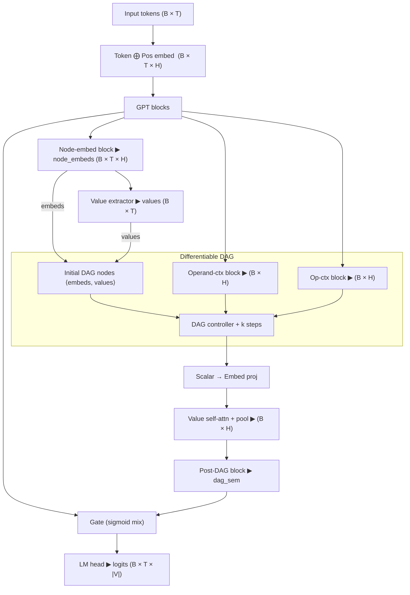

# nanoGPT-DAG ✧ _lightweight numeric reasoning for tiny GPTs_

This fork drops a **differentiable directed-acyclic-graph (DAG) module** on top of
[nanoGPT](https://github.com/karpathy/nanoGPT).  
The goal is to give a very small language model a dedicated sub-network that can
**read numbers out of text, perform a few arithmetic steps, then fold the
result back into the token stream**.

---

## How it works — one-paragraph version

1. **Plain GPT** runs as usual up to the final layer-norm.  
2. Those hidden states are **split three ways**  

   | branch | job |
   |--------|-----|
   | *node-embed block* | turn each token hidden state into a richer **embedding** that will live in the DAG |
   | *value extractor*  | attend over that embedding and spit out a **scalar value** (trying to recover the number the token represents, if any) |
   | *operand / op ctx blocks* | compress the sequence into two context vectors that will help the DAG choose its inputs and operations |

3. The **DAG controller** repeatedly  
   * attends over previous nodes (embeddings *and* values),  
   * picks two of them and an operation (`+ × − ÷ log pow max min identity`),  
   * creates a new node (new value + new embedding) and appends it.

4. After *k* steps we project **all DAG values back to embeddings**, do one
   self-attention + mean-pool, clean it with a tiny transformer block, and get a
   single vector `dag_sem`.

5. A learned **gate** mixes `dag_sem` with the last token’s hidden state, then
   the usual `lm_head` produces logits.

---

## Architecture diagram



---

## Install

```bash
pip install -r requirements-dev.txt
```

---

## Quick run (CPU toy)

```bash
python train.py config/train_default.py --dag_depth=4
```

Any field in `TrainConfig` can be overridden, e.g.
`--batch_size=4 --max_iters=100`.

---

## Tests

```bash
pytest
```

Tests cover:

* arithmetic op helpers  
* DAG growth & gradients  
* `extra_vals()` diagnostic hook  
* training-loop integration.

---

## Cloud training on RunPod

```bash
python3 -m venv env && source env/bin/activate
pip install requests runpod
export RUNPOD_API_KEY=<your_key>      # RunPod
export WANDB_API_KEY=<your_wandb_key> # Weights & Biases
python runpod_service.py train config/train_default.py --gpu-type "NVIDIA A100-40GB"
```

The helper prints the pod-id, GPU type and a direct W&B link so you can watch
loss curves live.

---

## Why learn the number extractor?

* **Multi-token numerals** – “12 345” is often `Ġ12`, `Ġ34`, `Ġ5`.  
* **Context disambiguation** – “route 66” ≠ numeric `66`.  
* **Unit scaling** – learn that “3 k” ⇒ `3000`.  
* **End-to-end gradients** – the extractor and embeddings co-adapt.
