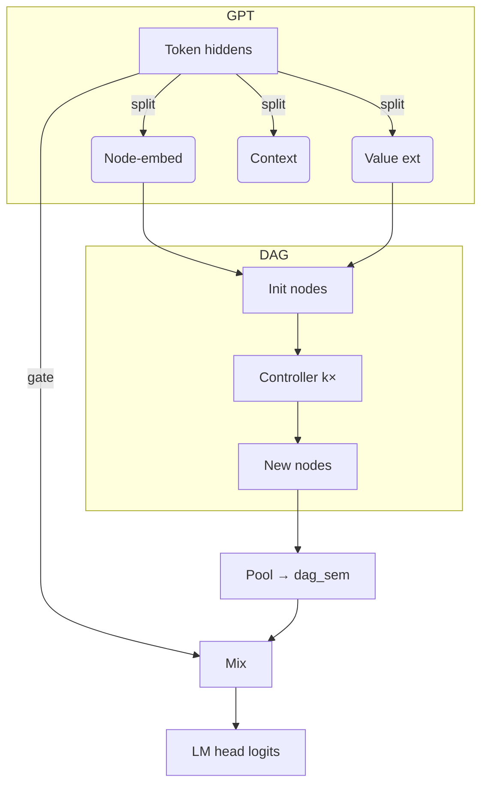

# nanoGPT-DAG

Lightweight numeric-reasoning on top of [nanoGPT](https://github.com/karpathy/nanoGPT).
A differentiable directed-acyclic-graph (DAG) module lets even tiny GPTs
extract numbers ✦ perform a few arithmetic steps ✦ fold the result back into the
LM stream – all in a single forward / backward pass.

---

## Quick start

```bash
# 1. install minimal deps (CPU-only)
pip install -r requirements-dev.txt

# 2. run a tiny demo training run (CPU)
python train.py config/train_default.py --dag_depth=2 --max_iters=100

# 3. run tests
pytest -q        # ~70 tests, <5 s on laptop
```

---

## What's inside  
• **DAG module** – value extractor, controller, operations (+ × − ÷ …)  
• **Gate mixer** – fuses DAG result with last token hidden state  
• **`DAGLogger`** – one-stop gradient/metric collector, wandb-ready  
• **Slim test-suite** – 69 functional + 1 integration test

---

## Tiny architecture sketch (Mermaid)



---

## Logging & monitoring

`DAGLogger` captures:
* gate stats, hidden norms
* per-op gradients (add, sub, mul, id)
* gradients of `final_hidden` & `final_values`
* node value timelines

`wandb.log(dag_logger.get_wandb_logging_dict(model))` – done.

---

## Directory layout (trimmed)

```
.
├─ dag_model.py        – GPT + DAG
├─ dag_logger.py       – logging / wandb bridge
├─ train.py            – single-GPU trainer
├─ tests/              – 70 nosy tests  (≈4 s)
└─ config/             – training presets
```

---

## License
MIT (same as nanoGPT)
