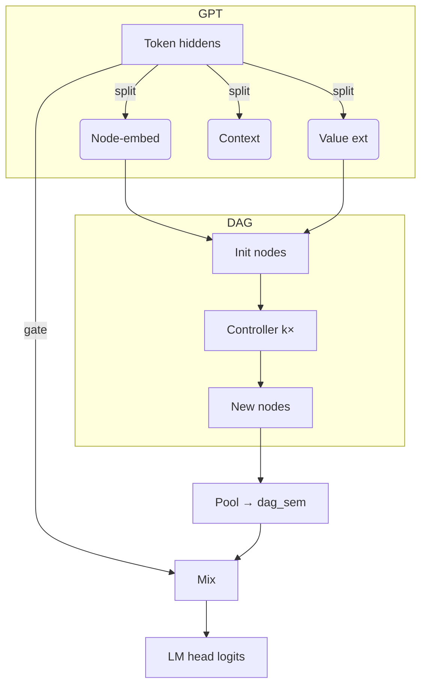

# nanoGPT-DAG

Lightweight numeric-reasoning on top of [nanoGPT](https://github.com/karpathy/nanoGPT).
A differentiable directed-acyclic-graph (DAG) module lets even tiny GPTs
extract numbers ✦ perform a few arithmetic steps ✦ fold the result back into the
LM stream – all in a single forward / backward pass.

---

## Quick start

```bash
# 1. install minimal deps (CPU-only)
pip install -r requirements-dev.txt

# 2. run a tiny demo training run (CPU)
python train.py config/train_default.py --dag_depth=2 --max_iters=100

# 3. run tests
pytest -q        # ~70 tests, <5 s on laptop
```

---

## What's inside  
• **DAG module** – value extractor, controller, operations (+ × − ÷ …)  
• **Gate mixer** – fuses DAG result with last token hidden state  
• **`DAGLogger`** – one-stop gradient/metric collector, wandb-ready  
• **Slim test-suite** – 69 functional + 1 integration test

---

## Tiny architecture sketch (Mermaid)



---

## Logging & monitoring

`DAGLogger` captures:
* gate stats, hidden norms
* per-op gradients (add, sub, mul, id)
* gradients of `final_hidden` & `final_values`
* node value timelines

`wandb.log(dag_logger.get_wandb_logging_dict(model))` – done.

---

## Directory layout (trimmed)

```
.
├─ dag_model.py        – GPT + DAG
├─ dag_logger.py       – logging / wandb bridge
├─ train.py            – single-GPU trainer
├─ tests/              – 70 nosy tests  (≈4 s)
└─ config/             – training presets
```

---

## License
MIT (same as nanoGPT)

## Differentiable DAG (per-token version)

Each token now owns an **independent, append-only scratch list** of scalar nodes.  Let `D = dag_depth`.

1.  Slot 0 is the value extracted from the token's transformer embedding.
2.  For each step `s ∈ [0, D-1]` the planner predicts:
    * `operand1`, `operand2`  – categorical over current `s+1` slots.
    * `op` – categorical over primitive operations {add, identity, multiply, subtract}.
3.  The executor reads the chosen operands, applies the selected op, and **appends** the result to slot `s+1` (no overwrites).
4.  After `D` steps the final slot (index `D`) is projected back to embedding space and mixed with the original transformer hidden state as:
   ```python
   dag_hidden_norm = LayerNorm(H) (dag_hidden) * dag_scale
   mixed_hidden    = orig_hidden + dag_hidden_norm
   ```

Tensor shapes (B=batch, T=sequence, S=D+1, n_ops=4):

| tensor                      | shape             |
|-----------------------------|-------------------|
| `operand*_probs`            | (B, T, D, S)      |
| `operation_probs`           | (B, T, D, n_ops)  |
| scratch values during exec  | (B, T, ≤S)        |
| final hidden                | (B, T, H)         |

The design guarantees causality:
* Tokens never access other tokens' scratch lists.
* At step `s`, masks ensure only slots `0..s` are visible.

See `dag_model.DAGPlanPredictor` and `dag_model.DifferentiableDAG` for implementation details.
