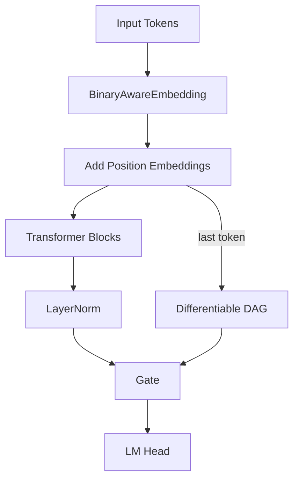

# nanoGPT DAG Experiment

This repository extends [nanoGPT](https://github.com/karpathy/nanoGPT) with a differentiable
DAG module for lightweight numeric reasoning. The DAG controller attends over
previous nodes and chooses simple operations such as addition and subtraction
(see `dag_model.py`). The `DAGGPT` model runs the transformer while preserving a
copy of the input embeddings. A separate DAG stream operates on this copy and
its final node is decoded back to a numeric token.
The module implements basic ops (`add`, `multiply`, `subtract`, `divide`, `identity`) and learns to compose them via attention.
The experiment evaluates whether this reasoning layer improves performance on small arithmetic problems.

## Architecture

The figure below illustrates how the differentiable DAG layer plugs into the regular GPT pipeline. The DAG receives the
initial token embeddings and operates independently from the transformer. At the final step a gate mixes the
transformer state with the DAG output.



The model processes tokens normally through the transformer to produce logits. In parallel, the DAG builds a numeric reasoning path from the raw token embeddings. A gating layer at the end chooses between the transformer state and the DAG output before decoding the final token.

## Installation

```bash
pip install -r requirements-dev.txt
```

## Training

Run a toy training job on CPU using the default configuration:

```bash
python train.py config/train_default.py --dag_depth=4
```

Any option in `TrainConfig` can be overridden on the command line, e.g.
`--max_iters=100` or `--batch_size=4`.

## Testing

```bash
pytest
```

The tests cover the tokenizer, DAG logic and the training script.

After running inference you can decode the DAG prediction to a float using
``DAGGPT.predict_number`` together with ``NumericTokenizer``.

## Benchmark

```bash
python bench.py
```

This benchmarks a minimal model forward and backward pass.

## RunPod

Set up a virtual environment and install the RunPod SDK:

```bash
python3 -m venv env
source env/bin/activate
python -m pip install runpod
```

Check the installed version:

```bash
pip show runpod
python3 -c "import runpod; print(runpod.__version__)"
```

Configure your API key in code:

```python
import runpod
import os

runpod.api_key = os.getenv("RUNPOD_API_KEY")
```

Launch training in the cloud:

```bash
python runpod_service.py train config/train_default.py --gpu "NVIDIA A100 40GB PCIe"
```

Or run inference using an existing endpoint:

```bash
python runpod_service.py infer "a math question" --endpoint ENDPOINT_ID
```

### Troubleshooting tips

* **502 errors** – ensure your pod has a GPU attached and inspect its logs for errors.
* **Storage full** – check disk usage with `df -h` and remove large files or mount a network volume.
* **Leaked API keys** – disable or revoke the compromised key from the console.
